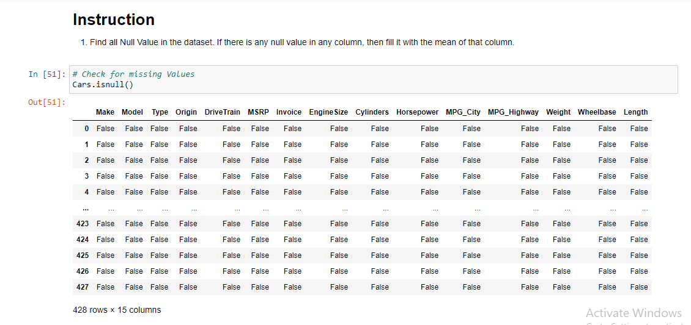
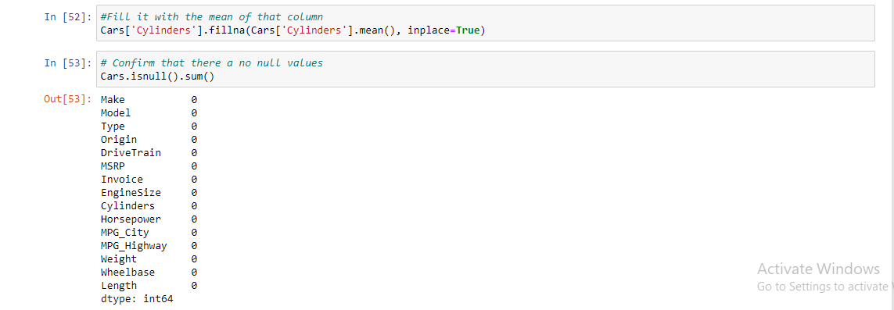
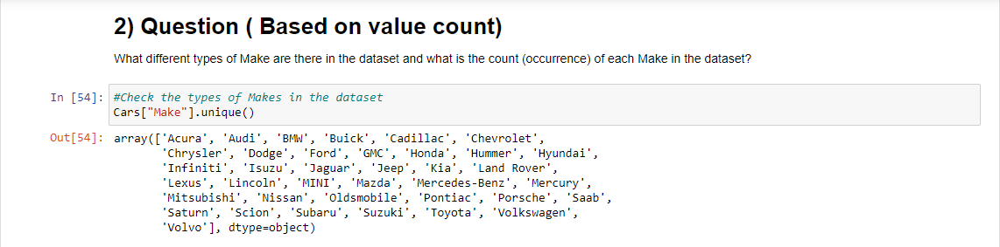
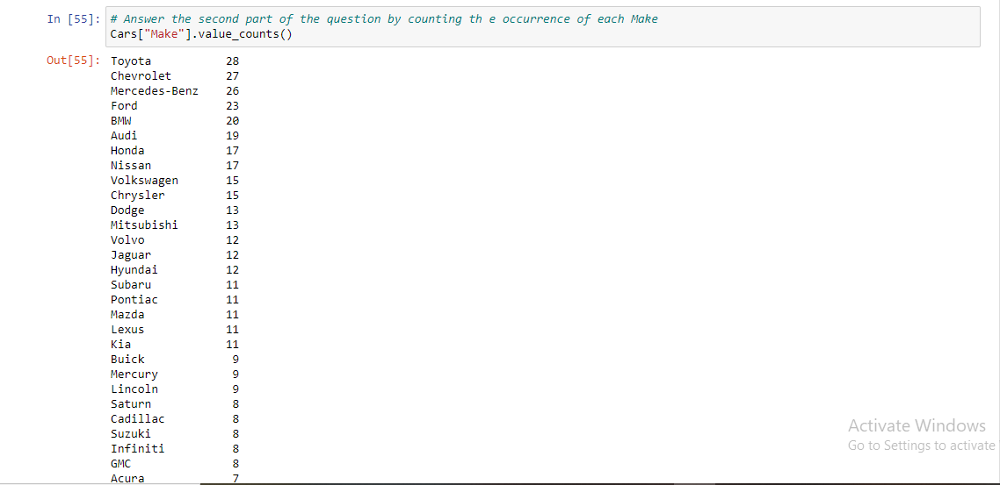
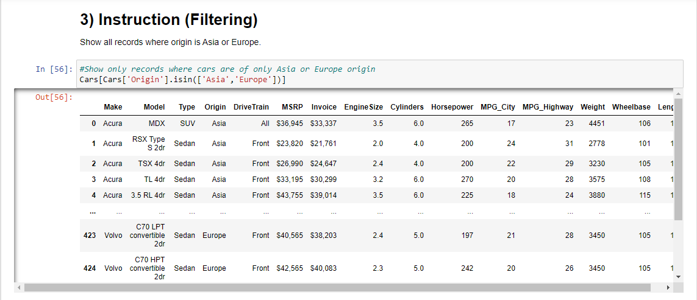
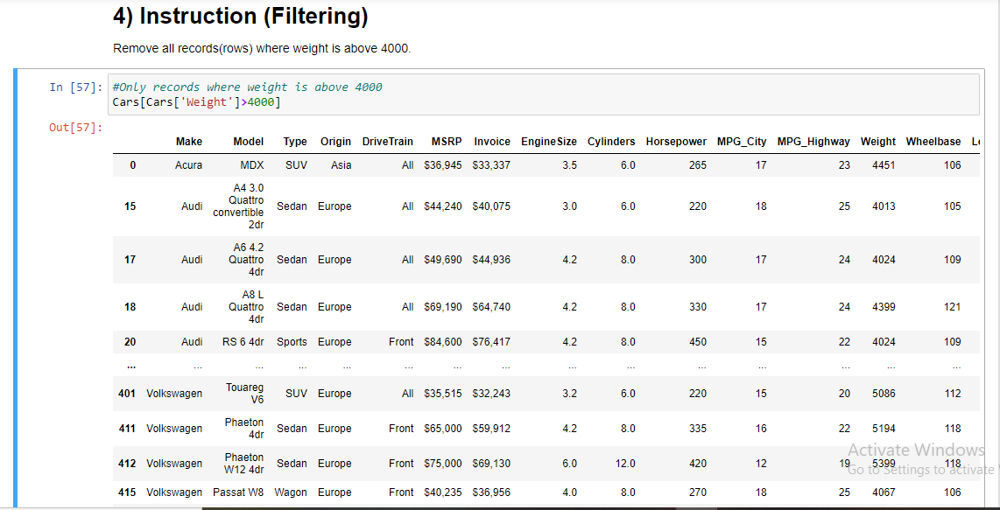
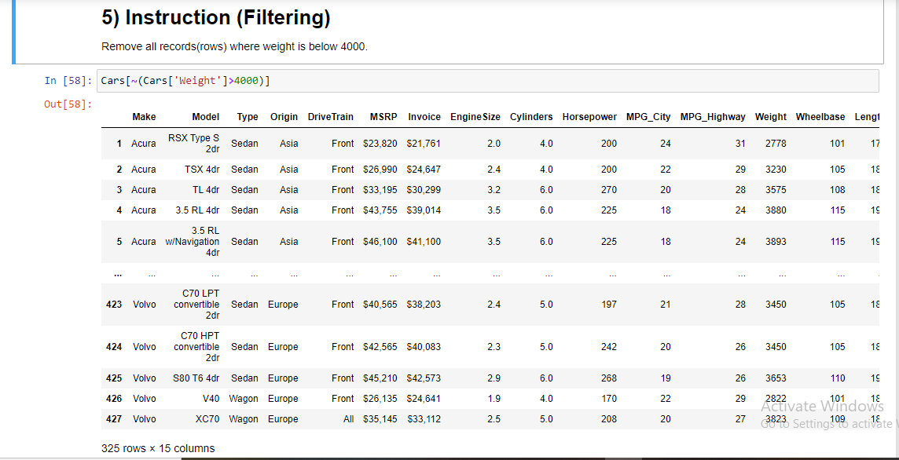
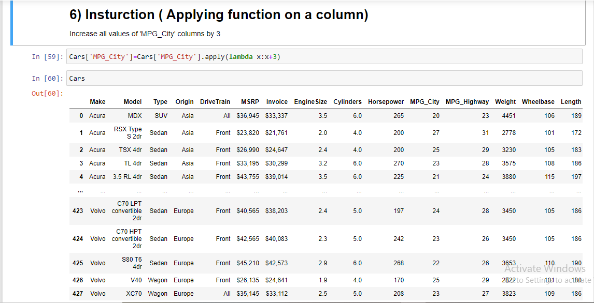

# CarsDataVault
Data Analysis (Python)

This project involves the examination of a car dataset, which includes a variety of car types, their models, and other pertinent information that may be of interest to potential customers.
Below are the steps and expected analysis by the employer.

# 1. Import Libraries such as Pandas and NumPy.

# 2. Load Data into Jupyter Notebook.

# 3. Check the datatypes, unique makes and column labels of the dataset.

# 4. Analysis instructions by employer and derived solutions

     a) Find all Null Value in the dataset. If there is any null value in any column, then fill it with the mean of that column.

     b) What different types of Make are there in the dataset and what is the count (occurrence) of each Make in the dataset?
 
 
 
     c) Show all records where origin is Asia or Europe.
 
 
     d) Remove all records(rows) where weight is above 4000

     e) Remove all records(rows) where weight is below 4000.
 
 
     f) Increase all values of 'MPG_City' columns by 3
 
